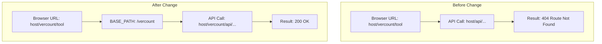

# ReplicaMon - Replication Monitoring & Reconciliation Tool

Compare AS400 journal entries with MSSQL Change Tracking to verify replication integrity and detect discrepancies.

## Overview

ReplicaMon validates that GlueSync replication is working correctly by:
1. Reading AS400 journal entries (source)
2. Reading MSSQL Change Tracking data (target)
3. Comparing operation counts and detecting discrepancies

## Prerequisites

- **qadmcli** - Must be installed and configured for AS400 and MSSQL connections
- **replica-cli** - For entity mapping (optional)
- Python 3.8+
- Environment variables configured (see `.env` file)

## Environment Setup

Create a `.env` file in the project directory (`replica-mon/.env`):

```bash
# AS400 Source Database
AS400_USER=your_as400_user
AS400_PASSWORD=your_as400_password

# MSSQL Target Database
MSSQL_USER=your_mssql_user
MSSQL_PASSWORD=your_mssql_password

# MSSQL Admin (for CT operations)
MSSQL_ADMIN_USER=your_mssql_admin_user
MSSQL_ADMIN_PASSWORD=your_mssql_admin_password

# GlueSync Core Hub (for dashboard & auto-discovery)
GLUESYNC_HOST=https://localhost:1717
GLUESYNC_ADMIN_USERNAME=admin
GLUESYNC_ADMIN_PASSWORD=your_gluesync_password
```

**⚠️ Security Note:** Never commit actual credentials to version control. Use environment variables or a `.env` file (added to `.gitignore`).

## Quick Start

### 0. Web Dashboard (Recommended for Real-Time Monitoring)

The dashboard provides a modern web UI with real-time WebSocket metrics, entity status, and verification tools:

```bash
cd ~/_qoder/replica-mon

# Start the dashboard backend
podman-compose up -d

# Access the dashboard
# Open: http://localhost:8000

# View logs
podman logs -f replica-mon

# Stop the dashboard
podman-compose down
```

**Dashboard Features:**
- 📊 Real-time replication metrics via WebSocket
- 🔍 Entity status monitoring (INSERT/UPDATE/DELETE counts)
- ✅ Verify tool: Compare AS400 vs MSSQL record counts
- 📈 Time-series metrics visualization
- 🎯 Multi-pipeline support

### 1. Automated CLI Monitoring

Monitor all GlueSync entities automatically with intelligent caching. The tool is fully containerized and will automatically build its Docker/Podman image on first run:

```bash
cd ~/_qoder/replica-mon

# Single check (auto-discovers entities from GlueSync)
./replica-mon.sh

# Continuous monitoring every 5 minutes
./replica-mon.sh --continuous

# Continuous monitoring every 1 minute
./replica-mon.sh --continuous --interval 60

# JSON output (for dashboards/APIs)
./replica-mon.sh --format json

# Check last hour only
./replica-mon.sh --since "$(date -d '1 hour ago' '+%Y-%m-%d %H:%M:%S')"
```

**Sample Output:**
```
🔍 Auto-discovering entities from GlueSync...
  📡 Discovered pipeline: 1st pipeline (f590ab8c)
  ✓ Found 3 active entities
  💾 Saved discovered config to: entities.json

📊 Monitoring 3 entities...
========================================================================================================================
  [1/3] Checking GSLIBTST.CUSTOMERS → dbo.CUSTOMERS...
    → ✅ OK (Journal: 34559, CT: 34559)
  [2/3] Checking GSLIBTST.CUSTOMERS2 → dbo.CUSTOMERS2...
    → ✅ OK (Journal: 1234, CT: 1234)
  [3/3] Checking GSLIBTST.ORDERS → dbo.ORDERS...
    → ✅ OK (Journal: 5678, CT: 5678)

========================================================================================================================
REPLICATION MONITORING RESULTS
========================================================================================================================
Source Table              Target Table              Status       Journal       CT   Diff Cache       Attention
------------------------------------------------------------------------------------------------------------------------
GSLIBTST.CUSTOMERS        dbo.CUSTOMERS             ✅ OK          34559    34559      +0 summary    ✓ No
GSLIBTST.CUSTOMERS2       dbo.CUSTOMERS2            ✅ OK           1234     1234      +0 summary    ✓ No
GSLIBTST.ORDERS           dbo.ORDERS                ✅ OK           5678     5678      +0 summary    ✓ No
========================================================================================================================

Summary: 3 OK, 0 Issues, 0 Flagged for Attention
```

### 2. Single Table Comparison (Manual)

For detailed comparison of a specific table, you can invoke `compare.py` through the container:

```bash
cd ~/_qoder/replica-mon

# Text format (human-readable)
./replica-mon.sh python3 compare.py --source GSLIBTST.CUSTOMERS --target dbo.CUSTOMERS

# JSON format (for automation)
./replica-mon.sh python3 compare.py --source GSLIBTST.CUSTOMERS --target dbo.CUSTOMERS --format json

# Filter by timestamp
./replica-mon.sh python3 compare.py --source GSLIBTST.CUSTOMERS --target dbo.CUSTOMERS --since "2026-04-10 01:00:00"
```

### 2. Sample Output

**Text Format:**
```
======================================================================
REPLICATION COMPARISON REPORT
======================================================================
Generated: 2026-04-10 02:15:30
Source (AS400): GSLIBTST.CUSTOMERS
Target (MSSQL): dbo.CUSTOMERS

[1/3] Querying AS400 journal...
  ✓ Retrieved 50 journal entries
[2/3] Querying MSSQL Change Tracking...
  ✓ Retrieved 50 CT changes
[3/3] Comparing...

======================================================================
COMPARISON RESULTS
======================================================================

Operation         AS400 Journal        MSSQL CT   Difference     Status
----------------------------------------------------------------------
INSERT                         30              30           +0         ✅
UPDATE                         15              15           +0         ✅
DELETE                          5               5           +0         ✅
TOTAL                          50              50           +0         ✅
======================================================================

✅ REPLICATION VERIFIED: All operations match!
```

**JSON Format:**
```json
{
  "timestamp": "2026-04-10T02:15:30",
  "source_table": "GSLIBTST.CUSTOMERS",
  "target_table": "dbo.CUSTOMERS",
  "since": null,
  "journal_summary": {
    "table": "GSLIBTST.CUSTOMERS",
    "total": 50,
    "inserts": 30,
    "updates": 15,
    "deletes": 5
  },
  "ct_summary": {
    "table": "dbo.CUSTOMERS",
    "total": 50,
    "inserts": 30,
    "updates": 15,
    "deletes": 5,
    "current_version": 9
  },
  "comparison": {
    "difference": 0,
    "discrepancies": [],
    "match": true
  }
}
```

## Configuration & Auto-Discovery

`monitor.py` operates at the **table level** (referred to as "entities" in GlueSync terminology). It queries AS400 journals and MSSQL Change Tracking specifically for configured table pairs.

### 1. Auto-Discovery (Default)

By default, `monitor.py` automatically pulls your active replication entities from the **`replica-cli`** tool. 

Behind the scenes, it looks for the `gluesync_cli_v2.py` script in the parent directory (e.g., `../replica-cli/gluesync_cli_v2.py`). It silently executes commands like `python3 gluesync_cli_v2.py --output json get pipelines` to identify your pipeline, and then queries the active entities within it. It extracts the AS400 source tables and MSSQL target tables, and saves this dynamically generated configuration into a local **`entities.json`** file.

### 2. Manual Configuration

If you prefer to explicitly define the tables to monitor (or if `gluesync-cli` is not available), you can create your own `entities.json` file:

```json
{
  "pipeline": "custom_pipeline",
  "entities": [
    {
      "source": "GSLIBTST.ORDERS",
      "target": "dbo.ORDERS",
      "status": "active"
    },
    {
      "source": "GSLIBTST.CUSTOMERS",
      "target": "dbo.CUSTOMERS",
      "status": "active"
    }
  ]
}
```
*(Note: `monitor.py` only monitors entities where `"status"` is set to `"active"`).*

You can also point the script to a specific custom configuration file and disable auto-discovery:

```bash
./replica-mon.sh --config custom_tables.json --no-auto-discover
```

## Advanced Usage

### Cache Management

ReplicaMon uses intelligent tiered caching for fast performance:

```bash
# View cache status for all tables
./replica-mon.sh python3 compare.py --cache-info

# View cache for specific table
./replica-mon.sh python3 compare.py --cache-info --source GSLIBTST.CUSTOMERS

# Clear all caches
./replica-mon.sh python3 compare.py --clear-cache

# Clear cache for specific table
./replica-mon.sh python3 compare.py --clear-cache --source GSLIBTST.CUSTOMERS

# List tables requiring attention (discrepancies detected)
./replica-mon.sh python3 compare.py --list-attention

# Reset attention flag for a table
./replica-mon.sh python3 compare.py --reset-attention --source GSLIBTST.CUSTOMERS

# Disable caching (always query AS400)
./replica-mon.sh --no-cache
```

### How Caching Works

**Tier 1: Summary Cache (Default)**
- Stores operation counts (~1 KB per table)
- Used for hourly monitoring
- Fast subsequent checks (1 sec vs 60 sec)

**Tier 2: Full Entry Cache (Auto-upgrade)**
- Automatically triggered when discrepancy detected
- Stores complete journal entries
- Used for detailed investigation
- Can be reset after issue resolved

**Cache Update Strategy:**
1. First run: Query AS400 (slow, builds cache)
2. Subsequent runs: Use cache + incremental updates (fast!)
3. Discrepancy detected: Auto-flag table for full caching
4. Manual review: Investigate flagged tables
5. Reset flag: Return to lightweight summary cache

### Monitoring Workflow

```bash
# Start continuous monitoring (runs in background via Podman detached or nohup)
nohup ./replica-mon.sh --continuous --interval 300 > replica.log 2>&1 &

# Check status anytime
./replica-mon.sh --format json | python3 -m json.tool

# View flagged tables
./replica-mon.sh python3 compare.py --list-attention

# Stop monitoring
kill %1  # or find PID and kill
```

### Using qadmcli Directly

You can also use qadmcli commands directly for more control:

**AS400 Journal Summary:**
```bash
cd ~/_qoder/qadmcli
source ../.env
export AS400_USER AS400_PASSWORD

# Get summary
./qadmcli.sh journal entries -t CUSTOMERS -l GSLIBTST --format summary

# Filter by time range
./qadmcli.sh journal entries -t CUSTOMERS -l GSLIBTST \
  --from-time "2026-04-10 01:00:00" \
  --to-time "2026-04-10 02:00:00" \
  --format summary
```

**MSSQL Change Tracking Summary:**
```bash
cd ~/_qoder/qadmcli
source ../.env
export MSSQL_USER MSSQL_PASSWORD

# Get summary
./qadmcli.sh mssql ct changes -t CUSTOMERS -s dbo --format summary

# Filter by timestamp
./qadmcli.sh mssql ct changes -t CUSTOMERS -s dbo \
  --since "2026-04-10 01:00:00" \
  --format summary

# Filter by version
./qadmcli.sh mssql ct changes -t CUSTOMERS -s dbo \
  --since-version 5 \
  --format summary
```

### Using Library Classes in Python

```python
from lib.as400_journal import AS400JournalReader
from lib.mssql_ct import MSSQLCTReader

# AS400 Journal
journal = AS400JournalReader()
summary = journal.get_summary("GSLIBTST.CUSTOMERS", since="2026-04-10 01:00:00")
print(f"Journal inserts: {summary['inserts']}")

# MSSQL CT
ct = MSSQLCTReader()
ct_summary = ct.get_summary("dbo.CUSTOMERS", since="2026-04-10 01:00:00")
print(f"CT inserts: {ct_summary['inserts']}")
```

## CLI Reference

### monitor.py - Automated Entity Monitoring

```bash
python3 monitor.py [OPTIONS]

Options:
  --config FILE          Use specific entity config file
  --since TIMESTAMP      Filter changes since timestamp
  --format table|json    Output format (default: table)
  --continuous           Run in continuous monitoring mode
  --interval SECONDS     Check interval in seconds (default: 300)
  --no-cache             Disable journal caching
  --no-cache-status      Hide cache status in table
  --no-auto-discover     Disable GlueSync auto-discovery

Examples:
  # Single check with auto-discovery
  python3 monitor.py

  # Continuous monitoring every 5 minutes
  python3 monitor.py --continuous

  # JSON output for dashboard
  python3 monitor.py --format json

  # Check last hour only
  python3 monitor.py --since "$(date -d '1 hour ago' '+%Y-%m-%d %H:%M:%S')"
```

### compare.py - Single Table Comparison

```bash
python3 compare.py --source LIBRARY.TABLE --target SCHEMA.TABLE [OPTIONS]

Options:
  --source TABLE         AS400 source table (LIBRARY.TABLE)
  --target TABLE         MSSQL target table (SCHEMA.TABLE)
  --since TIMESTAMP      Filter changes since timestamp
  --format table|json    Output format (default: table)
  --timezone-only        Show timezone info and exit
  --no-timezone          Hide timezone information
  --no-cache             Disable journal caching
  --cache-info           Show cache information and exit
  --clear-cache          Clear journal cache and exit
  --reset-attention      Reset attention flag for table
  --list-attention       List all tables requiring attention

Examples:
  # Compare single table
  python3 compare.py --source GSLIBTST.CUSTOMERS --target dbo.CUSTOMERS

  # Compare with time filter
  python3 compare.py --source GSLIBTST.CUSTOMERS --target dbo.CUSTOMERS \
    --since "2026-04-13 00:00:00"

  # JSON output for automation
  python3 compare.py --source GSLIBTST.CUSTOMERS --target dbo.CUSTOMERS \
    --format json
```

## Understanding the Output

### Journal Entry Codes (AS400)

| Code | Operation | Description |
|------|-----------|-------------|
| `PT` | INSERT | Put/Insert operation |
| `UP` | UPDATE | Update operation |
| `DL` | DELETE | Delete operation |
| `CG` | COMMIT | Commit/Group |
| `JF` | COMMIT | Journal File |

### CT Operation Codes (MSSQL)

| Code | Operation | Description |
|------|-----------|-------------|
| `I` | INSERT | Row inserted |
| `U` | UPDATE | Row updated |
| `D` | DELETE | Row deleted |

### Discrepancy Examples

If replication is not working correctly, you might see:

```
Operation         AS400 Journal        MSSQL CT   Difference     Status
----------------------------------------------------------------------
INSERT                         30              28           +2         ❌
UPDATE                         15              15           +0         ✅
DELETE                          5               5           +0         ✅
TOTAL                          50              48           +2         ❌
======================================================================

⚠️  DISCREPANCY DETECTED!

Discrepancies:
  - Total count mismatch: source=50, target=48
  - Inserts count mismatch: source=30, target=28
```

This indicates 2 INSERT operations were not replicated to MSSQL.

## Automation Examples

### Cron Job for Hourly Checks

```bash
# Add to crontab
0 * * * * cd /home/ubuntu/_qoder/replica-mon && \
  ./replica-mon.sh python3 compare.py --source GSLIBTST.CUSTOMERS --target dbo.CUSTOMERS \
  --format json >> /var/log/replica-mon/hourly_check.json 2>&1
```

### Alert on Discrepancy

```bash
#!/bin/bash
# check_replication.sh

RESULT=$(cd /home/ubuntu/_qoder/replica-mon && ./replica-mon.sh python3 compare.py --source GSLIBTST.CUSTOMERS --target dbo.CUSTOMERS --format json)
MATCH=$(echo "$RESULT" | python3 -c "import sys, json; print(json.load(sys.stdin)['comparison']['match'])")

if [ "$MATCH" = "False" ]; then
    echo "ALERT: Replication discrepancy detected!" | mail -s "ReplicaMon Alert" admin@example.com
    echo "$RESULT" >> /var/log/replica-mon/alerts.log
fi
```

## Troubleshooting

### Dashboard Issues

**Dashboard not accessible at http://localhost:8000:**
```bash
# Check if container is running
podman ps | grep replica-mon

# Check container logs
podman logs replica-mon

# Restart the dashboard
podman-compose down && podman-compose up -d
```

**Verify tool not showing AS400 counts:**
```bash
# Check if qadmcli config is mounted
podman exec replica-mon ls -la /app/qadmcli/config/

# Check verify logs for errors
podman logs --tail 100 replica-mon | grep -i "verify"

# Ensure .env has GlueSync credentials
cat .env | grep GLUESYNC
```

**WebSocket not connecting:**
```bash
# Verify GlueSync is running
curl -k https://localhost:1717

# Check container has host network access
podman exec replica-mon curl -k https://localhost:1717
```

### CLI Issues

### qadmcli not found
Ensure qadmcli is in the correct location and executable:
```bash
ls -la ../qadmcli/qadmcli.sh
chmod +x ../qadmcli/qadmcli.sh
```

### Environment variables not set
Source the .env file:
```bash
cd ~/_qoder
source .env
export AS400_USER AS400_PASSWORD MSSQL_USER MSSQL_PASSWORD
```

### Connection errors
Test qadmcli connections:
```bash
# Test AS400
./qadmcli.sh journal info -t CUSTOMERS -l GSLIBTST

# Test MSSQL
./qadmcli.sh mssql ct status -t CUSTOMERS -s dbo
```

## Architecture

ReplicaMon has **two operational modes**:

### Mode 1: Web Dashboard (Always Running)

```
┌─────────────────────────────────────────────────────────┐
│                   Web Browser                           │
│              http://localhost:8000                      │
└────────────────────┬────────────────────────────────────┘
                     │ WebSocket + REST API
                     ▼
┌─────────────────────────────────────────────────────────┐
│          replica-mon Container (podman-compose)         │
│                                                         │
│  • FastAPI Backend (port 8000)                         │
│  • WebSocket Metrics Stream                            │
│  • Verify Tool (AS400 ↔ MSSQL counts)                  │
│  • Entity Auto-Discovery                               │
│                                                         │
│  Volumes:                                               │
│    - ./cache:/app/replica-mon/cache:Z                  │
│    - ./metrics:/app/replica-mon/metrics:Z              │
│    - ../qadmcli/config:/app/qadmcli/config:Z           │
│                                                         │
│  Network: host (accesses GlueSync at localhost:1717)   │
└──────┬──────────────────────────────┬──────────────────┘
       │                              │
       │ REST/WebSocket               │ qadmcli (JayDeBeApi)
       ▼                              ▼
┌──────────────────┐          ┌──────────────────┐
│  GlueSync        │          │  AS400           │
│  Core Hub        │          │  (161.82.146.249)│
│  :1717           │          │                  │
└──────────────────┘          └──────────────────┘
```

**Start:** `podman-compose up -d`  
**Use for:** Real-time monitoring, verification, web UI

### Mode 2: CLI Tools (One-Shot Commands)

```
┌─────────────────────────────────────────────────────────┐
│                   Terminal                               │
│              ./replica-mon.sh                           │
└────────────────────┬────────────────────────────────────┘
                     │ podman run --rm
                     ▼
┌─────────────────────────────────────────────────────────┐
│          replica-mon Container (ephemeral)              │
│                                                         │
│  • monitor.py (entity monitoring)                      │
│  • compare.py (single table comparison)                │
│  • Auto-discovery from replica-cli                     │
│  • Intelligent caching                                 │
│                                                         │
│  Volumes:                                               │
│    - ./cache:/app/replica-mon/cache:Z                  │
│    - ./metrics:/app/replica-mon/metrics:Z              │
│    - ../qadmcli/config:/app/qadmcli/config:Z           │
└──────┬──────────────────────────────┬──────────────────┘
       │                              │
       │ qadmcli commands             │ qadmcli (JayDeBeApi)
       ▼                              ▼
┌──────────────────┐          ┌──────────────────┐
│  AS400           │          │  MSSQL           │
│  Journal         │          │  Change Tracking │
│  (Source)        │          │  (Target)        │
└──────────────────┘          └──────────────────┘
```

**Start:** `./replica-mon.sh`  
**Use for:** Batch jobs, cron tasks, detailed comparisons, JSON output

### Key Features

- **Auto-Discovery**: Automatically detects entities from GlueSync pipeline
- **Intelligent Caching**: Summary + full entry tiered caching
- **Auto-Flagging**: Automatically flags tables with discrepancies
- **Continuous Monitoring**: Scheduled checks with configurable intervals
- **Timezone-Aware**: Handles AS400 (UTC+0) vs MSSQL (UTC+7) differences
- **JSON Output**: Ready for dashboards, APIs, and automation

## Git Workflow

This project follows standard Git workflow practices. See [`GIT_WORKFLOW.md`](../GIT_WORKFLOW.md) for details.

### Recent Changes

- **v0.5.0** - Web Dashboard & Container Architecture Update
  - Added FastAPI-based web dashboard with real-time WebSocket metrics
  - Introduced `podman-compose.yaml` for dashboard backend deployment
  - Updated `replica-mon.sh` to support new container volume structure
  - Added verify tool: Compare AS400 vs MSSQL record counts from UI
  - Added qadmcli config volume mount for AS400 counting support
  - Removed `--rebuild` flag (use `podman build` directly if needed)

- **v0.4.0** - Dockerization & Documentation Cleanup
  - Introduced `Containerfile` and `podman-compose.yaml` to containerize the monitoring tool natively.
  - Added `replica-mon.sh` wrapper script for streamlined execution.
  - Added `--rebuild` flag to dynamically update containerized dependencies.
  - Consolidated extensive documentation into an `archive/` folder.

- **v0.3.0** - Automated monitoring with auto-discovery
  - Added monitor.py for continuous entity monitoring
  - Auto-discovery from GlueSync CLI (no manual config needed)
  - Intelligent tiered caching (summary + full entry)
  - Auto-flagging tables with discrepancies
  - Timezone-aware comparisons (AS400 UTC+0, MSSQL UTC+7)
  - JSON output for dashboards and APIs

- **v0.2.0** - Enhanced caching and timezone handling
  - Journal caching for 60-120x performance improvement
  - Automatic timezone detection and normalization
  - Cache management CLI commands
  - Attention flag system for problematic tables

- **v0.1.0** - Initial release
  - Basic comparison report feature
  - AS400 journal and MSSQL CT integration
  - Time-based filtering

## Proxy & Subpath Deployment

When deployed behind a reverse proxy (e.g. Traefik) under a custom subpath prefix (like `/replica-mon`), the frontend dynamically detects the base path from `window.location.pathname` to ensure that API and WebSocket connections route correctly without hardcoding:



The base path resolution evaluates:
* `BASE_PATH`: Extracts any preceding path prefix, stripping routing keywords like `/tool` or trailing slashes.
* `API_HOST`: Resolves to `${location.protocol}//${location.host}${BASE_PATH}`.
* `WS_HOST`: Resolves to the correct secure (`wss:`) or unsecure (`ws:`) protocol prefix + `${location.host}${BASE_PATH}`.

This makes the application completely subpath-aware out-of-the-box and fully backward-compatible with root level deployments (where `BASE_PATH` resolves to `""`).

## License

Internal use only.
