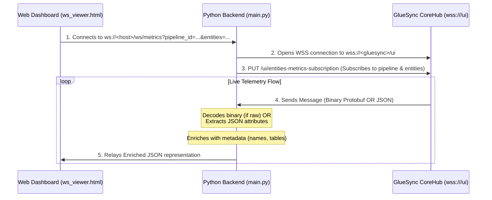

# GlueSync WebSocket Architecture & Decoder Details

This document details the telemetry monitoring stream in `replica-mon`, explaining how live metrics and status updates are intercepted, decoded, and relayed to the web dashboard.

---

## 1. The Relay Architecture (How it Connects)

To bypass browser-level restriction issues and avoid loading raw binary parsing onto the frontend, `replica-mon` uses a **Backend Relay Pattern**:



### Flow Details:
1. **Frontend Request**: The Web Dashboard (`ws_viewer.html`) connects to the Python backend via:
   ```javascript
   const socketUrl = `ws://localhost:8081/ws/metrics?pipeline_id=${pipelineId}&entities=${entities}`;
   const ws = new WebSocket(socketUrl);
   ```
2. **Backend Subscription**: Upon receiving a connection, the FastAPI backend retrieves the user's active Bearer Token, initiates a Python `GlueSyncWebSocketClient`, and issues a `PUT /ui/entities-metrics-subscription` to register the pipeline and target entities.
3. **Continuous Streaming**: The backend reads messages from GlueSync, processes/decodes them, and pushes them instantly to the active browser frontend.

---

## 2. Message Formats & Decoding

GlueSync streams telemetry data in two formats depending on the version and configuration. The backend client handles both natively:

### A. Modern JSON Messages (GlueSync 2.2.8+)
In newer versions, GlueSync can transmit structured telemetry messages as JSON. The backend detects if the incoming payload is a JSON dictionary containing `"type"` and `"content"` keys, extracting the following message types:

1. **`MetricsMessage`**: Contains real-time counters.
   * *Extracted Fields*: `inserts`, `updates`, `deletes`, `totalOps`.
   * *Relayed Output*: Standardized into normalized metrics and saved to the SQLite metrics store (`ws_metrics` table).
2. **`EntityStatusMessage`**: Contains active sync flags.
   * *Extracted Fields*: `isMigrationActive`, `isSyncActive`, `isBusy`.
   * *State Mapping*:
     * `isMigrationActive` = 1 → `MIGRATING` (Snapshot phase)
     * `isSyncActive` = 1 → `RUNNING` (CDC phase)
     * `isBusy` = 1 → `PAUSED`
     * Otherwise → `STOPPED`
3. **`PipelineStatusMessage`**: Discovered agent health mapping.
   * *Extracted Fields*: Normalizes agent connections (`connectionStatus`, `status`, `connectedDatabaseHost`, `connectionError`) into `AgentHealthMessage` relayed to the client and stored in the database.

### B. Protobuf Binary Messages (Fallback)
If the message is received as raw binary bytes (or older Protobuf frames), the backend invokes a custom, zero-dependency recursive decoder:

* **Varints (Wire Type 0)**: Decodes operational metrics and integer enums.
* **Length-Delimited (Wire Type 2)**: Attempts to decode as UTF-8. If it encounters control characters, it recursively calls itself to unpack nested message layers.
* **Result**: Parses raw protobuf into generic JSON representations:
  ```json
  {
    "Field_1_string": "MetricsMessage",
    "Field_2_message": {
      "Field_1_message": {
        "Field_1_message": {
          "Field_2_message": {
            "Field_1_string": "GSLIBTST.CUSTOMERS",
            "Field_2_string": "2026-05-21T08:01:35Z",
            "Field_4_varint": 150,
            "Field_5_varint": 320,
            "Field_6_varint": 12,
            "Field_7_varint": 482
          }
        }
      }
    }
  }
  ```

---

## 3. Capture Capability & Extensibility

### Capture All Messages
Because the low-level `SimpleWebSocket` socket receiver simply forwards raw payloads and the `parse_protobuf` script reads structural wire-format tag wrappers recursively, **the client is guaranteed to capture and parse all message types** (including undocumented, newly added, or custom messages).

* **Unmapped Fields**: If GlueSync introduces a new message or field, the parser still decodes it into a generic representation (e.g., `Field_X_varint` or `Field_X_string`) and pushes it to the front-end stream console without crashing or throwing parse errors.
* **Dynamic Metadata Enrichment**: On connection startup, the backend queries the REST API and caches the mapping between Entity IDs (e.g., `4bacd683`) and Entity Names (e.g., `GSLIBTST.THAI_TEST`). If a telemetry frame references an ID rather than a name, the backend performs a two-step lookup to resolve and append human-readable metadata in a `_enriched` block.
